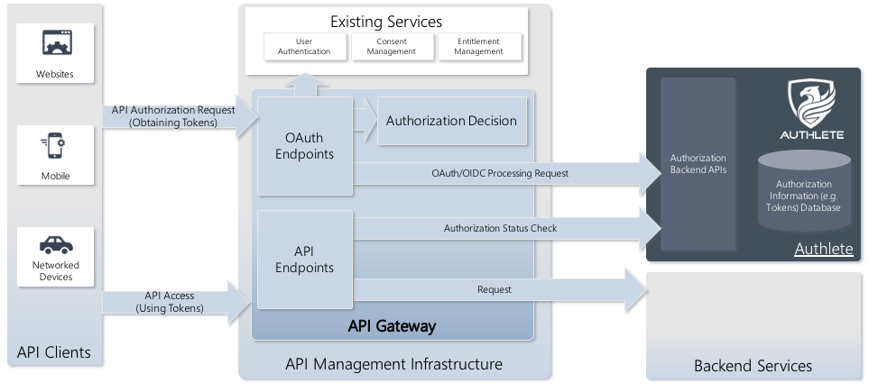

# authlete-openapi

Jsoniter also provides methods to read or stream JSON directly from disk or network without transforming it into a string first.


Supported input types include: `Array[Byte]`, `java.nio.ByteBuffer`, and `java.io.InputStream/java.io.FileInputStream`.


If multiple response types share the same schema, use `anyOf` instead of `oneOf`.

In Tapir, `anyOf` is used to define multiple possible response types for an endpoint. This is useful when an API can return different types of responses depending on conditions (e.g., success, error, or different response formats).


For tapir to generate documentation,it needs a Schema to help OpenAPi know the structure of the class

```scala
  def jsonBody[T: JsonValueCodec: Schema]: EndpointIO.Body[String, T] = stringBodyUtf8AnyFormat(jsoniterCodec[T])
  ```
  `jsonBody` requires both `JsonValueCodec` and `Schema` 
  The Schema describes the shape of the data and it is used for 
  - validation
  - documentation

`jsonBody` is the integration between `JsonValueCodec` and `Schema` and `jsonBody` helps to
- decode
- encode
- shape for documentation


```scala

  /** An output which contains a number of variant outputs. Each variant can contain different outputs and represent different content. To
    * describe an output which represents same content, but with different content types, use [[oneOfBody]].
    *
    * All possible outputs must have a common supertype (`T`). Typically, the supertype is a sealed trait, and the variants are implementing
    * case classes.
    *
    * When encoding to a response, the first matching output is chosen, using the following rules:
    *   1. the variant's `appliesTo` method, applied to the output value (as returned by the server logic) must return `true`.
    *   1. when a fixed content type is specified by the output, it must match the request's `Accept` header (if present). This implements
    *      content negotiation.
    *
    * When decoding from a response, the first output which decodes successfully is chosen.
    *
    * The outputs might vary in status codes, headers (e.g. different content types), and body implementations. However, for bodies, only
    * replayable ones can be used, and they need to have the same raw representation (e.g. all byte-array-base, or all file-based).
    *
    * Note that exhaustiveness of the variants (that all subtypes of `T` are covered) is not checked.
    */
  def oneOf[T](firstVariant: OneOfVariant[_ <: T], otherVariants: OneOfVariant[_ <: T]*): EndpointOutput.OneOf[T, T] =
    EndpointOutput.OneOf[T, T](firstVariant +: otherVariants.toList, Mapping.id)

  /** Create a one-of-variant which uses `output` if the class of the provided value (when interpreting as a server) matches the runtime
    * class of `T`.
    *
    * This will fail at compile-time if the type erasure of `T` is different from `T`, as a runtime check in this situation would give
    * invalid results. In such cases, use [[oneOfVariantClassMatcher]], [[oneOfVariantValueMatcher]] or [[oneOfVariantFromMatchType]]
    * instead.
    *
    * Should be used in [[oneOf]] output descriptions.
    */
  def oneOfVariant[T: ClassTag: ErasureSameAsType](output: EndpointOutput[T]): OneOfVariant[T] =
    oneOfVariantClassMatcher(output, implicitly[ClassTag[T]].runtimeClass)

  /** Create a one-of-variant which uses `output` if the class of the provided value (when interpreting as a server) matches the runtime
    * class of `T`. Adds a fixed status-code output with the given value.
    *
    * This will fail at compile-time if the type erasure of `T` is different from `T`, as a runtime check in this situation would give
    * invalid results. In such cases, use [[oneOfVariantClassMatcher]], [[oneOfVariantValueMatcher]] or [[oneOfVariantFromMatchType]]
    * instead.
    *
    * Should be used in [[oneOf]] output descriptions.
    */
  def oneOfVariant[T: ClassTag: ErasureSameAsType](code: StatusCode, output: EndpointOutput[T]): OneOfVariant[T] =
    oneOfVariant(statusCode(code).and(output))

/** Create a one-of-variant which uses `output` if the class of the provided value (when interpreting as a server) matches the given
    * `runtimeClass`. Note that this does not take into account type erasure.
    *
    * Should be used in [[oneOf]] output descriptions.
    */
  def oneOfVariantClassMatcher[T](
      output: EndpointOutput[T],
      runtimeClass: Class[_]
  ): OneOfVariant[T] = {
    // when used with a primitive type or Unit, the class tag will correspond to the primitive type, but at runtime
    // we'll get boxed values
    val rc = primitiveToBoxedClasses.getOrElse(runtimeClass, runtimeClass)
    OneOfVariant(output, { (a: Any) => rc.isInstance(a) })
  }

  /** Create a one-of-variant which uses `output` i the class of the provided value (when interpreting as a server) matches the given
    * `runtimeClass`. Note that this does not take into account type erasure. Adds a fixed status-code output with the given value.
    *
    * Should be used in [[oneOf]] output descriptions.
    */
  def oneOfVariantClassMatcher[T](
      code: StatusCode,
      output: EndpointOutput[T],
      runtimeClass: Class[_]
  ): OneOfVariant[T] = oneOfVariantClassMatcher(statusCode(code).and(output), runtimeClass)

  /** Create a one-of-variant which uses `output` if the provided value (when interpreting as a server matches the `matcher` predicate).
    *
    * Should be used in [[oneOf]] output descriptions.
    */
  def oneOfVariantValueMatcher[T](output: EndpointOutput[T])(
      matcher: PartialFunction[Any, Boolean]
  ): OneOfVariant[T] =
    OneOfVariant(output, matcher.lift.andThen(_.getOrElse(false)))

  /** Create a one-of-variant which uses `output` if the provided value (when interpreting as a server matches the `matcher` predicate).
    * Adds a fixed status-code output with the given value.
    *
    * Should be used in [[oneOf]] output descriptions.
    */
  def oneOfVariantValueMatcher[T](code: StatusCode, output: EndpointOutput[T])(
      matcher: PartialFunction[Any, Boolean]
  ): OneOfVariant[T] =
    OneOfVariant(statusCode(code).and(output), matcher.lift.andThen(_.getOrElse(false)))

  /** Create a one-of-variant which uses `output` if the provided value exactly matches one of the values provided in the second argument
    * list.
    *
    * Should be used in [[oneOf]] output descriptions.
    */
  def oneOfVariantExactMatcher[T: ClassTag](
      output: EndpointOutput[T]
  )(
      firstExactValue: T,
      rest: T*
  ): OneOfVariant[T] =
    oneOfVariantValueMatcher(output)(exactMatch(rest.toSet + firstExactValue))

  /** Create a one-of-variant which uses `output` if the provided value exactly matches one of the values provided in the second argument
    * list. Adds a fixed status-code output with the given value.
    *
    * Should be used in [[oneOf]] output descriptions.
    */
  def oneOfVariantExactMatcher[T: ClassTag](
      code: StatusCode,
      output: EndpointOutput[T]
  )(
      firstExactValue: T,
      rest: T*
  ): OneOfVariant[T] =
    oneOfVariantValueMatcher(code, output)(exactMatch(rest.toSet + firstExactValue))

  /** Create a one-of-variant which uses `output` if the provided value equals the singleton value. The `output` shouldn't map to any
    * values, that is, it should be `Unit` -typed. The entire variant is, on the other hand, typed with the singleton's type `T`.
    *
    * Should be used in [[oneOf]] output descriptions.
    *
    * @see
    *   [[oneOfVariantExactMatcher]] which allows specifying more exact-match values, and where `output` needs to correspond to type `T`.
    */
  def oneOfVariantSingletonMatcher[T](output: EndpointOutput[Unit])(singletonValue: T): OneOfVariant[T] =
    oneOfVariantValueMatcher(output.and(emptyOutputAs(singletonValue)))({ case a: Any => a == singletonValue })

  /** Create a one-of-variant which uses `output` if the provided value equals the singleton value. The `output` shouldn't map to any
    * values, that is, it should be `Unit` -typed. The entire variant is, on the other hand, typed with the singleton's type `T`.
    *
    * Adds a fixed status-code output with the given value.
    *
    * Should be used in [[oneOf]] output descriptions.
    *
    * @see
    *   [[oneOfVariantExactMatcher]] which allows specifying more exact-match values, and where `output` needs to correspond to type `T`.
    */
  def oneOfVariantSingletonMatcher[T](code: StatusCode, output: EndpointOutput[Unit])(singletonValue: T): OneOfVariant[T] =
    oneOfVariantValueMatcher(code, output.and(emptyOutputAs(singletonValue)))({ case a: Any => a == singletonValue })

  /** Create a one-of-variant which will use a fixed status-code output with the given value, if the provided value equals the singleton
    * value. The entire variant is typed with the singleton's type `T`.
    *
    * Should be used in [[oneOf]] output descriptions.
    *
    * @see
    *   [[oneOfVariantExactMatcher]] which allows specifying more exact-match values, and where `output` needs to correspond to type `T`.
    */
  def oneOfVariantSingletonMatcher[T](code: StatusCode)(singletonValue: T): OneOfVariant[T] =
    oneOfVariantValueMatcher(code, emptyOutputAs(singletonValue))({ case a: Any => a == singletonValue })

  /** Create a one-of-variant which uses `output` if the provided value matches the target type, as checked by [[MatchType]]. Instances of
    * [[MatchType]] are automatically derived and recursively check that classes of all fields match, to bypass issues caused by type
    * erasure.
    *
    * Should be used in [[oneOf]] output descriptions.
    */
  def oneOfVariantFromMatchType[T: MatchType](output: EndpointOutput[T]): OneOfVariant[T] =
    oneOfVariantValueMatcher(output)(implicitly[MatchType[T]].partial)

  /** Create a one-of-variant which uses `output` if the provided value matches the target type, as checked by [[MatchType]]. Instances of
    * [[MatchType]] are automatically derived and recursively check that classes of all fields match, to bypass issues caused by type
    * erasure. Adds a fixed status-code output with the given value.
    *
    * Should be used in [[oneOf]] output descriptions.
    */
  def oneOfVariantFromMatchType[T: MatchType](code: StatusCode, output: EndpointOutput[T]): OneOfVariant[T] =
    oneOfVariantValueMatcher(code, output)(implicitly[MatchType[T]].partial)

  /** Create a fallback variant to be used in [[oneOf]] output descriptions. Multiple such variants can be specified, with different body
    * content types.
    */
  def oneOfDefaultVariant[T](output: EndpointOutput[T]): OneOfVariant[T] = OneOfVariant(output, _ => true)

```  


Log requests & responses using slf4j
`"com.softwaremill.sttp.client3" %% "slf4j-backend" % "3.10.3"`


```scala

  val backend: SttpBackend[Identity, Any] =
    Slf4jLoggingBackend(
      HttpClientSyncBackend(),
      includeTiming = true,
      logRequestBody = false,
      logResponseBody = false
    )
```


Note that all `fs2` backends also support any `cats-effect` effect, additionally supporting request & response streaming.


Also note that the `http4s` backend can also be created for a type implementing the `cats-effect`’s `Async` typeclass, and supports streaming as in `fs2`.


sttp supports read and connection timeouts:

- Connection timeout - can be set globally (30 seconds by default)

- Read timeout - can be set per request (1 minute by default)

```scala
import sttp.client4._
import scala.concurrent.duration._

// all backends provide a constructor that allows to specify backend options
val backend = DefaultSyncBackend(
  options = BackendOptions.connectionTimeout(1.minute))

basicRequest
  .get(uri"...")
  .readTimeout(5.minutes) // or Duration.Inf to turn read timeout off
  .send(backend)
```  


Both `postRequest(uri: Uri)` and `postRequest[R: JsonValueCodec](uri: Uri)` have the same parameter list.
Scala cannot distinguish them because type parameters do not contribute to method overloading resolution.

having issues with `metals`, you can run `rm -rf ~/.metals` to delete the `.metals` folder


`cd ~/Library/Application\ Support/`

Access tokens must always be associated with scopes

[oauth-oidc-mistakes](https://darutk.medium.com/oauth-oidc-mistakes-7f3bb909518b)

If the client omits the scope parameter when requesting authorization, the authorization server MUST either process the request using a pre-defined default value or fail the request indicating an invalid scope.


You design access
tokens in terms of business privileges to APIs. You should customize the access token
for each client to only give them least-privilege API access. 


OAuth 2.0 focuses on API authorization

```A zero-trust approach does not assume any implicit trust, e.g. based on infrastructure
rules such as internal network addresses. Zero trust means that you should use
explicit trust and not assume that requests come from a certain client or user. With
regards to API security, this implies that APIs must always verify the caller.
```

```
Access tokens are your API credentials. You design them to enable APIs to enforce
least privilege access. First, access tokens can be designed to restrict access by busi‐
ness area. Next, you can include values in the access token that your APIs use for
authorization. These can be user attributes or runtime values such as the authenti‐
cation strength. This provides the most powerful ways for your APIs to authorize
requests. Finally, assign access tokens a short lifetime to limit the impact of any
potential misuse.
```


When an API validates access tokens, it immediately rejects any requests containing
altered or expired tokens. Otherwise, the API trusts the identity attributes in the
access token and uses them for business authorization. When implemented correctly
this approach provides zero-trust in terms of your business.

APIs do not trust each other. Instead, they only trust the authorization
server.

OAuth enables clients to send restricted access tokens to APIs, which then authorize requests
based on the attributes in the access token. You can use OAuth to scale security to
many APIs

Often, the caller of APIs is a user. Consequently, the user must authenticate before
calling APIs. Users do not interact directly with APIs and instead use a client appli‐
cation as their delegate. When possible authenticate both the user and the client
application before issuing the client an access token

```
Authlete is a BaaS (Backend as a Service) providing set of APIs to be used for implementing OAuth 2.0 authorization servers and/or OpenID Connect identity providers.
```
`first party` integration - the loyalty program and e-commerce site are both run by the same company.

`docker network create --driver bridge authlete-net`

You can check the container logs to verify that the container started correctly 
`docker logs authlete-ecommerce`

http://localhost:8080/ecommerce/oauth //redirect uri


```json
{
  "service_name": "Loyalty",
  "auth_uri": "http://localhost:8081/loyalty/oauth/authorization",
  "redirect_uri": "http://localhost:8080/ecommerce/oauth",
  "token_uri": "http://authlete-loyalty:8080/loyalty/oauth/token",
  "api_endpoint": "http://authlete-loyalty:8080/loyalty/api/currentCustomer",
  "query_params": {
    "prompt": "login"
  },
}
```


The response’s action property indicates what the servlet should do next, and responseContent holds data that the servlet will relay back to the client.


In the OAuth 2.0 context, a server that issues access tokens (and optionally refresh tokens) is called authorization server. On the other hand, in the OpenID Connect context, a server that issues ID tokens is called OpenID Provider (IdP)


OAuth endpoints, such as authorization endpoint, will be placed in your environment, not ours. Therefore, you can customize UI and UX with no limit. For example, you can separate the authentiation page from authorization page, or you can allow your end-users to choose scopes to be granted.


You can integrate Authlete with any IAM solution, authentication solution or API gateway solution of your choice because Authlete focuses on authorization function only. For example, if you have a authentication and IAM systems for your existing service, you can minimize the cost of introducing OAuth and OpenID Connect by integrating Authlete into those systems.

## Single Access Token per Subject
Authlete revokes issued tokens and issues a new access token every time the same user grants an authorization request from a client.

## Granted Scopes Management
Authlete enables customers to get a list of (or remove) scopes that are granted end-users.

This function is only available for Enterprise Plan users.

## Caching introspection responses
In some use cases, caching responses from Authlete’s introspection endpoint improves performance of response at resource server APIs.

- Install a cache server of your choice e.g. Redis at your authorization server or resource server(s).
- Configure the cache server to store responses from Authlete’s introspection endpoint


### API gateway products that have been integrated with Authlete



Deploying API gateways is not necessary for Authlete itself to work. But in some cases integration between API gateways and Authlete would be valuable.

API gateways can leverage Authlete to enhance/replace their OAuth authorization server function


You can integrate Authlete with Amazon API Gateway with its Lambda Authorizers so that the gateway can handle access tokens which Authlete has issued.


[financial_grade_apigateway](https://www.authlete.com/developers/tutorial/financial_grade_apigateway/)


[access-tokens/extra-properties](https://www.authlete.com/kb/oauth-and-openid-connect/access-tokens/extra-properties/)

[custom_authorizer](https://www.authlete.com/developers/custom_authorizer/)


```sh
RUN groupadd --gid 10000 apiuser \
  && useradd --uid 10001 --gid apiuser --shell /bin/bash --create-home apiuser
USER 10001
```


Each access token has a scope that limits its purpose, that is which API functionalities
a client can access

authenticated encryption- both encrypts and authenticates

difference between authorization and access control
authorization is something people do
access control is enforced by the system- what you are allowed to do


### what is Proof of Posession?
- what: POP demonstrates possesion of cryptographic aterial when performing an operation
- How:Typically with a signature in conjunction with a token that contains or references the POP key used to sign
- Why: Preventing use of a leaked/stolen token